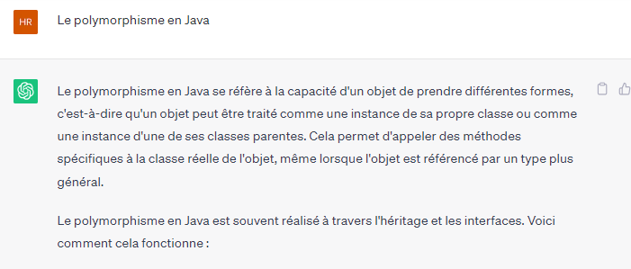

<H2> Polymorphisme</h2>

Le mot «polymorphisme» dérive de deux mots, à savoir 'Poly' ce qui signifie beaucoup et ' morphes »Signifiant des formes. Ainsi, le polymorphisme signifie de nombreuses formes. Dans un langage de programmation, nous pouvons dire qu'un objet peut prendre plusieurs formes

.
  
 

 

 

 
 
 
  

Le polymorphisme permet de créer un code plus flexible et générique, car vous pouvez écrire du code qui manipule des objets en fonction de leurs fonctionnalités communes plutôt que de leurs classes spécifiques. Cela favorise la réutilisabilité, la modularité et la maintenabilité du code.

